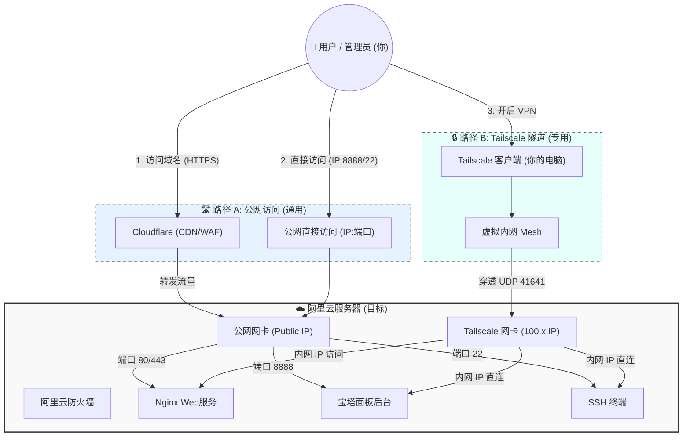

这是一个非常好的复盘请求。通过对整个过程的系统化梳理，不仅能帮你巩固知识，还能在未来遇到类似问题时快速定位。

根据你提供的截图线索（阿里云轻量服务器、宝塔面板、Cloudflare、Tailscale 异地组网），我为你整理了这份\*\*《全链路服务器部署与内网穿透操作手册》\*\*。

-----

# 第一部分：全链路架构复盘图 (Mermaid)

首先，我们需要从上帝视角看清楚数据流是如何走的。



-----

# 第二部分：详细操作手册

本手册涵盖从购买到最终上线的五个关键阶段。

## 阶段一：基础设施准备 (购买与初始化)

### 1\. 购买服务器

  * **操作**：登录阿里云/腾讯云，选择“轻量应用服务器 (Lightweight Server)”。
  * **配置建议**：
      * **地域**：如果是建站，选距离目标用户近的（国内需备案，香港/海外无需备案但有延迟）。
      * **镜像**：选择 **Debian 11/12** 或 **Ubuntu 20.04/22.04**（相比 CentOS 更适合现代软件环境）。
      * **实例**：2核 2G 内存起步，带宽建议 3Mbps 以上。

### 2\. 初始化安全组 (防火墙)

  * **难点解释**：服务器不仅有内部防火墙，云厂商还有一层“安全组”。如果不放行端口，外面怎么敲门都进不来。
  * **操作**：
      * 在云控制台找到“安全组”或“防火墙”。
      * **必开端口**：
          * `TCP 22` (SSH连接，建议后续改为非常规端口)
          * `TCP 80` (HTTP)
          * `TCP 443` (HTTPS)
          * `TCP 8888` (宝塔面板默认端口，装完后建议修改)
          * `UDP 41641` (Tailscale 打洞通信端口，**重要**)

## 阶段二：环境搭建 (宝塔面板)

### 1\. 安装宝塔面板

  * **操作**：
    1.  使用阿里云网页版 SSH 或本地终端登录服务器。
    2.  去宝塔官网复制安装脚本（Ubuntu/Debian版）。
    3.  粘贴运行：`wget -O install.sh ... && bash install.sh`。
    4.  **关键记录**：安装完成后，终端会显示**面板地址、用户名、密码**，必须截图或复制保存。

### 2\. 面板基础配置

  * 登录面板后，选择“LNMP”套件（推荐 Nginx 1.22+, MySQL 5.7/8.0, PHP 8.1）。
  * **安全加固**：在面板设置中，修改默认端口（把 8888 改为其他），修改默认安全入口字符串。

## 阶段三：内网穿透与管理网搭建 (Tailscale)

此步骤用于构建你自己的“秘密通道”，即使不开放公网 SSH 端口，也能安全管理服务器。

### 1\. 安装 Tailscale

  * **操作**：在服务器终端执行：
    ```bash
    curl -fsSL https://tailscale.com/install.sh | sh
    ```
  * **启动与绑定**：
    ```bash
    sudo tailscale up
    ```
    复制生成的链接，在浏览器登录你的 Google/Microsoft 账号进行授权。

### 2\. 客户端配置

  * 在你的 Windows 电脑、手机、NAS 上分别安装 Tailscale 并登录同一账号。
  * **结果**：所有设备都会获得一个 `100.x.y.z` 的内网 IP。

### 3\. (进阶) 开启 MagicDNS

  * **操作**：在 Tailscale 网页控制台 -\> DNS，启用 MagicDNS。
  * **效果**：你可以直接通过机器名（如 `ping aliyun-bt`）访问服务器，不再需要记 IP。

### 4\. **维护与更新 (对应你的报错)**

  * **知识点**：Tailscale 分为两部分：`tailscaled` (后台服务) 和 `tailscale` (命令行工具)。如果通过网页点击更新，可能会出现二进制文件更新了，但服务进程没重启的情况。
  * **修复命令**：
    ```bash
    sudo systemctl restart tailscaled
    ```

## 阶段四：域名解析与 CDN (Cloudflare)

### 1\. 域名托管

  * **场景**：无论你在哪里买的域名（NameSilo, GoDaddy, 阿里云），建议将 DNS 解析权交给 Cloudflare 管理。
  * **操作**：
    1.  注册 Cloudflare 账号，点击 "Add a Site"。
    2.  输入你的域名。
    3.  Cloudflare 会给你两个 Nameserver 地址（如 `bob.ns.cloudflare.com`）。
    4.  回到你购买域名的注册商后台，修改 DNS 服务器为上面这两个。

### 2\. 设置 DNS 解析 (A 记录)

  * **操作**：
      * 进入 Cloudflare -\> DNS -\> Records。
      * 添加记录：
          * Type: **A**
          * Name: `@` (代表根域名) 或 `www`
          * Content: **[填入你阿里云服务器的公网 IP]**
          * Proxy status: **Proxied (橘色云朵)** —— **重要！**

### 3\. SSL/TLS 设置

  * **操作**：进入 Cloudflare -\> SSL/TLS -\> Overview。
  * **选择**：**Full (Strict)**。
      * *注意*：如果选 Flexible，可能会导致重定向循环（ERR\_TOO\_MANY\_REDIRECTS），因为 CF 到你服务器是 HTTP，你服务器强制转 HTTPS，导致死循环。

## 阶段五：网站/服务上线

### 1\. 宝塔新建站点

  * **操作**：
    1.  宝塔面板 -\> 网站 -\> 添加站点。
    2.  域名填写：`yourdomain.com`。
    3.  PHP版本：按需选择。
    4.  数据库：按需创建。

### 2\. 申请 SSL 证书 (Let's Encrypt)

  * **操作**：
    1.  点击站点设置 -\> SSL -\> Let's Encrypt。
    2.  **难点技巧**：由于 Cloudflare 开了小黄云（CDN），传统的“文件验证”可能会失败。建议使用 **DNS 验证**（需要配合 API Key），或者：
    3.  **更简单的方案**：在 Cloudflare 生成“Origin Server Certificate”（源服务器证书），有效期15年，把公钥私钥粘贴到宝塔的“其他证书”里。这样最稳定，且实现了全链路加密。

-----

# 第三部分：知识难点与原理解析 (Q\&A)

### 难点 1：为什么报错说 "cmd/tailscale version does not match"？

  * **解释**：Linux 软件更新通常分两步：1. 替换硬盘上的文件；2. 重启内存中运行的进程。
  * Tailscale 的网页更新帮你在硬盘上下载了新版（v1.90.8），但原来的旧版进程（v1.90.6）还卡在内存里运行。新版命令去跟旧版进程对话，协议对不上，就报错了。
  * **教训**：遇到 Linux 服务异常，第一反应应该是 `systemctl restart xxx`。

### 难点 2：Cloudflare 的“小黄云”到底做了什么？

  * **不开小黄云 (DNS Only)**：Cloudflare 只充当电话本，告诉用户你的真实 IP。坏人查到了可以直接攻击你的阿里云服务器。
  * **开启小黄云 (Proxied)**：Cloudflare 充当**中间人**（反向代理）。
      * 用户访问 -\> Cloudflare 边缘节点 IP。
      * Cloudflare -\> 你的阿里云 IP。
      * **好处**：隐藏了你的真实 IP，防御 DDoS 攻击，通过 CDN 加速静态资源。

### 难点 3：为什么有了公网 IP 还要装 Tailscale？

  * **公网 IP (阿里云)**：是为了给普通用户访问网站用的（开放 80/443）。
  * **Tailscale IP (内网)**：是为了给你（管理员）用的。
      * 你可以关闭阿里云安全组的 `22` 端口（防爆破），只通过 Tailscale 内网 IP 进行 SSH 连接。
      * 你可以直接访问宝塔面板，而不必担心面板端口暴露在公网被扫描。
      * 它把云服务器变成了你“局域网”里的一台电脑。

### 难点 4：反向代理 (Nginx) 是什么？

  * 你的服务器里可能跑了很多软件（网站在 80，Python脚本在 5000，Docker容器在 3000）。
  * 但用户只认 80/443 (HTTP/HTTPS)。
  * **Nginx 的作用**：像个前台接待员。
      * 用户找 `a.com` -\> Nginx 把请求转给 80 端口的网站文件。
      * 用户找 `api.a.com` -\> Nginx 把请求转给 5000 端口的 Python 程序。
      * 这就是“反向代理”。

这份文档涵盖了从底层硬件到应用层交付的全流程。建议你可以将此保存为 PDF 或 Notion 文档，作为你的个人技术资产。
